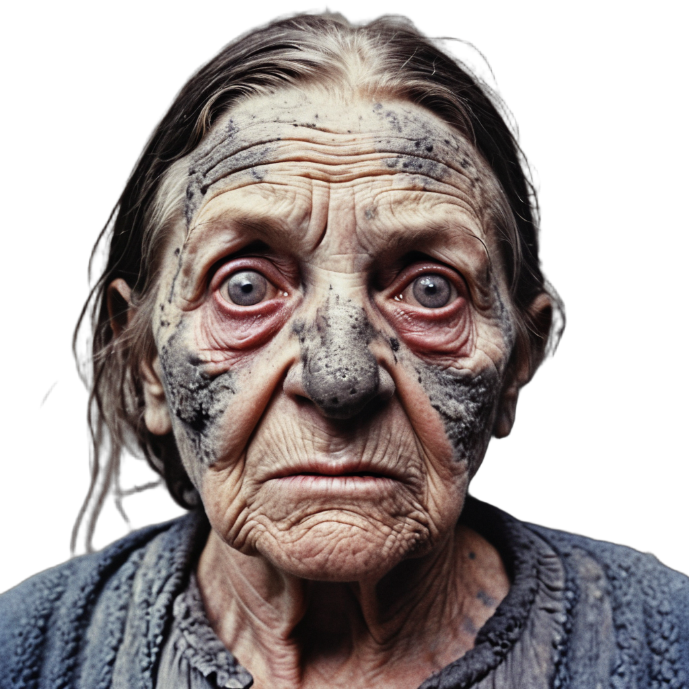

# SDXL Image Harmonization

[English](#english) | [Русский](#русский)

<a id="english"></a>

## Purpose

This local image-compositing example uses segmentation and SDXL inpainting with Tile ControlNet to blend a foreground subject into a background. It is a small inference pipeline, not a hosted service or a general-purpose editor.

## Pipeline

1. [`BirefNetCutter`](cutter.py) uses `rembg` to segment the source portrait and writes an RGBA cutout.
2. [`Composer.compose()`](composer.py) places the cutout at the requested position and creates a collage plus an L-mode inpainting mask. The example uses `full`: the mask is white across the entire canvas, so the model may regenerate the complete scene. The composer also supports `edge`, `background_primary`, and `figure_primary` masks for more localized experiments.
3. [`FactorCNetComposerInpainter`](inpainters.py) sends the collage, mask, prompt, and settings through the SDXL inpainting pipeline with Tile ControlNet.
4. The inpainted result and run metadata are saved as `outCNet.png` and `outCNet.metadata.json`.

## Included visual example

The checked-in images show the inputs, intermediate cutout, and an example output:

| Image | Description |
| --- | --- |
|  | `factory.png`: grayscale industrial courtyard used as the background. |
|  | `comrade_6.png`: portrait input before background removal. |
|  | `sporous.png`: the RGBA foreground produced by segmentation. |
|  | `outCNet.png`: example SDXL + Tile ControlNet harmonization output. |

The example output illustrates a full-canvas repaint, not a guarantee that the original background or subject details will be preserved exactly.

## Install and run

Use Python 3.13 and [uv](https://docs.astral.sh/uv/). The project metadata in [`pyproject.toml`](pyproject.toml) declares direct runtime dependencies; [`uv.lock`](uv.lock) locks their resolved versions. There is no separate `requirements.txt` manifest.

From the repository root:

```sh
uv sync --locked
uv run --locked python main.py
```

The demo reads `comrade_6.png` and `factory.png` relative to the current directory. It writes the segmentation cutout to `sporous.png`, the harmonized image to `outCNet.png`, and a JSON run record to `outCNet.metadata.json`.

For the model-free regression suite:

```sh
uv run --locked python -m unittest discover -s tests -v
```

Tests mock model inference and do not download model weights. Importing [`main.py`](main.py) does not run the demo; execution is protected by its standard main guard.

## Models, cache, and hardware

The example loads the BiRefNet `rembg` model plus the Hugging Face model IDs listed in its metadata: the SDXL inpainting checkpoint, `xinsir/controlnet-tile-sdxl-1.0`, and `madebyollin/sdxl-vae-fp16-fix`. The first run needs network access and downloads model files into the respective library caches; later runs reuse those caches. Model revisions are not pinned, so a model repository update can change later output.

The inpainters select an available backend in MPS, CUDA, then CPU preference order, and use float16 on MPS/CUDA or float32 on CPU. CPU execution is supported but SDXL with ControlNet at the example resolution is computationally expensive and memory intensive; a suitable accelerator is strongly recommended. Actual performance and memory requirements depend on the hardware and installed PyTorch build. The cutter separately chooses installed ONNX Runtime providers and can retry with its CPU provider if accelerator session initialization fails.

The demo uses seed `1729` for Diffusers generation and records the effective seed, prompt, settings, model IDs, selected device/dtype, and selected dependency versions in the sidecar. This improves run traceability; it does not promise bitwise-identical output across hardware, model revisions, or library versions. The seed is for the inpainting generator and does not pin model files.

## Limitations

- The default `full` mask allows changes across the whole canvas and can alter scene details or subject appearance. Try one of the localized mask modes in the composition call when preservation is more important.
- The composer rounds background dimensions down to multiples of 64 and resizes the foreground for SDXL-compatible dimensions; this may discard or resample image detail.
- CPU fallback makes the pipeline available without an accelerator, not fast. The standard SDXL + ControlNet stack may exceed memory available on smaller devices.
- The Hub model IDs are not revision-pinned and outputs are not guaranteed to be deterministic across environments.

---

<a id="русский"></a>

## Назначение

Локальный пример сегментирует объект и объединяет передний план с фоном с помощью SDXL Inpainting и Tile ControlNet. Это небольшой конвейер инференса, а не сервис или универсальный редактор изображений.

## Этапы

1. [`BirefNetCutter`](cutter.py) удаляет фон с портрета через `rembg` и сохраняет RGBA-вырезку.
2. [`Composer.compose()`](composer.py) накладывает объект и формирует коллаж с маской. В примере используется режим `full`: маска белая по всему изображению, поэтому модель может перерисовать всю сцену. Также доступны режимы `edge`, `background_primary` и `figure_primary`.
3. [`FactorCNetComposerInpainter`](inpainters.py) передает коллаж, маску, текст и настройки в SDXL Inpainting с Tile ControlNet.
4. Результат и параметры запуска записываются в `outCNet.png` и `outCNet.metadata.json`.

Изображения выше показывают исходный двор `factory.png`, портрет `comrade_6.png`, промежуточную вырезку `sporous.png` и пример результата `outCNet.png`. Пример демонстрирует полную перерисовку сцены, а не гарантированное сохранение исходных деталей.

## Установка и запуск

Нужны Python 3.13 и [uv](https://docs.astral.sh/uv/). Источник прямых runtime-зависимостей — [`pyproject.toml`](pyproject.toml), разрешенные версии фиксируются в [`uv.lock`](uv.lock). Отдельного `requirements.txt` нет.

Запустите из корня репозитория:

```sh
uv sync --locked
uv run --locked python main.py
```

Для тестов без загрузки моделей:

```sh
uv run --locked python -m unittest discover -s tests -v
```

При первом запуске нужны сеть и загрузка весов; последующие запуски используют кеш библиотек. Для SDXL + ControlNet при размере примера рекомендуется подходящий ускоритель; CPU работает в float32, но генерация может быть очень медленной и требовать значительной памяти. Автоматически выбирается доступный MPS, CUDA или CPU. Сид `1729` и сведения о фактической конфигурации записываются в JSON рядом с результатом, но одинаковые пиксели на разных устройствах и версиях библиотек не гарантируются.

Режим маски `full` позволяет менять весь кадр. Идентификаторы моделей не привязаны к конкретным ревизиям Hub. Поэтому результат может меняться при обновлении моделей или зависимостей.
