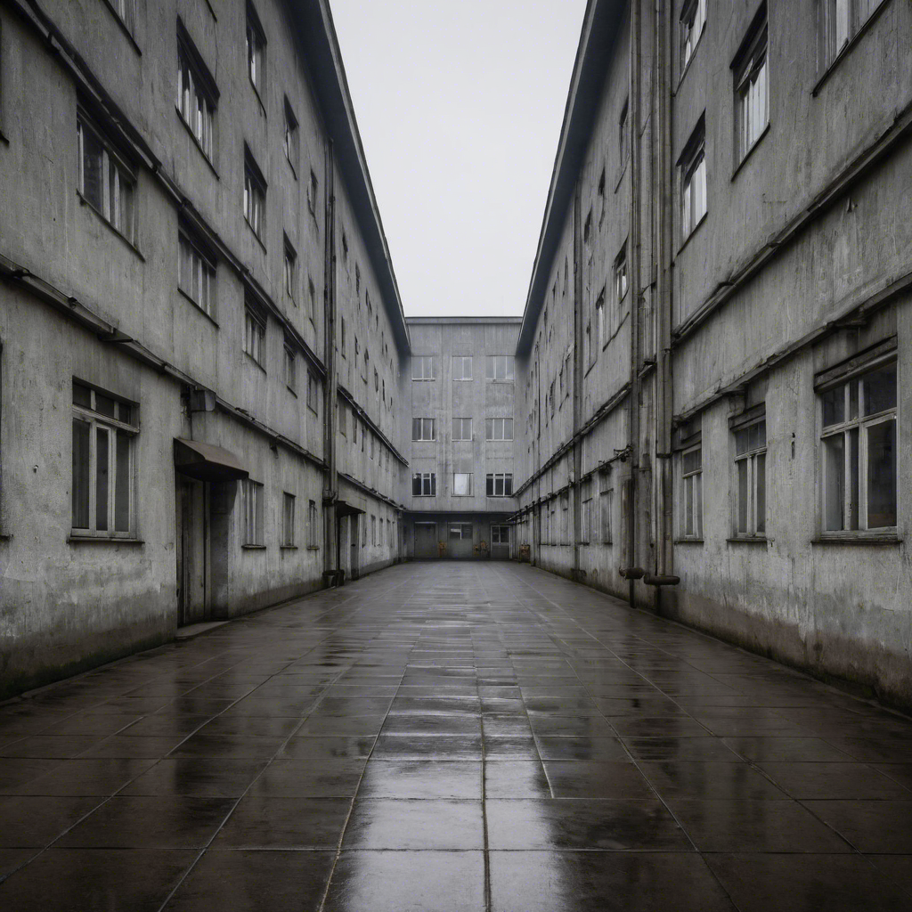
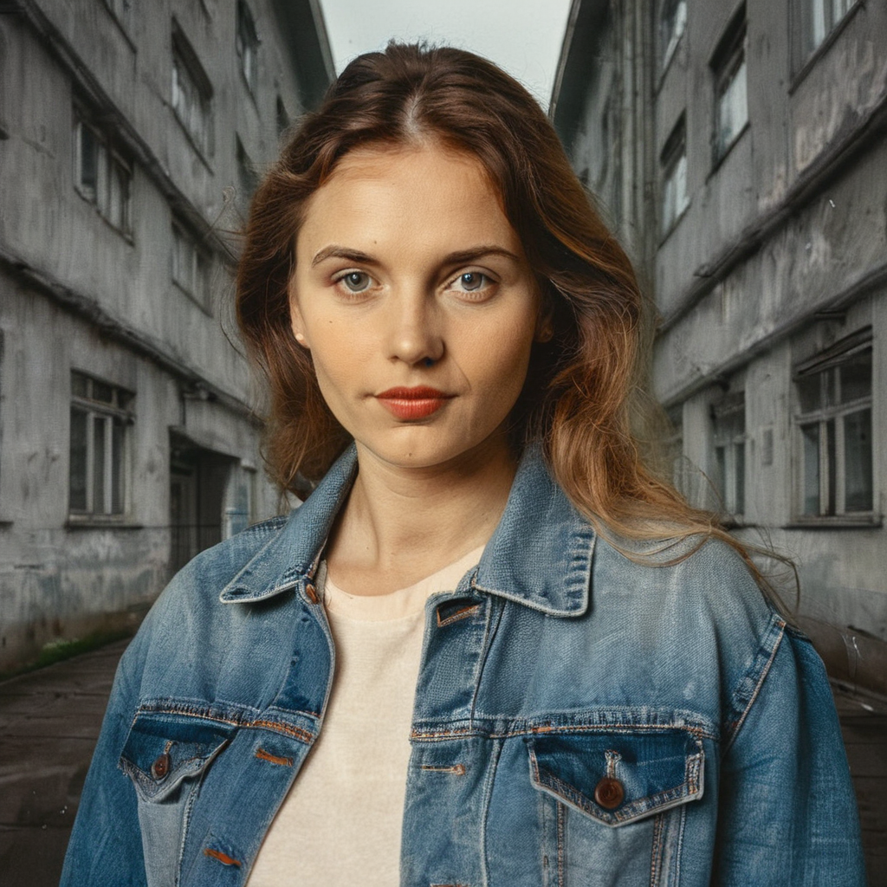

[English](#english) | [Русский](#русский)

# SDXL Inpainter Pipeline

## What does it do / plan to do?
I created this lightweight layer blender for local SDXL generation to smooth out raw collages and eliminate that "pasted-on" look.
The core idea is to use a diffusion model to seamlessly blend two layers—globally harmonizing not just the lighting (as in IC-Light), but unifying all fine details and textures across the composition.
In the latest commit, I achieved solid image quality by integrating ControlNet (Tile).
You can feed in an already cropped RGBA image with an alpha channel or supply a raw portrait—to segment the subject automatically, just use one of the wrapper classes in cutter.py.

##### ++++++

##### ======

---

# SDXL Inpainter Pipeline

## Что оно делает / должно делать?
Создавал этот небольшой склеиватель для разных слоев, сгенерированных SDXL на локальном компе с целью избежать эффекта коллажа. 

Смысл в том, чтобы с помощью диффузионной нейронки притереть два слоя друг к другу — глобально сгладить не только освещение (как в IC-Light), но в целом все детали.

В последнем коммите мне удалось добиться адекватного качества при помощи использования ControlNet типа Tile. 

Вы можете подать не только вырезанное изображение с альфа-каналом, но и "сырой" портрет -- для того, чтобы вырезать человека, примените один из классов-ярлыков в cutter.py

##### ++++++

##### ======

