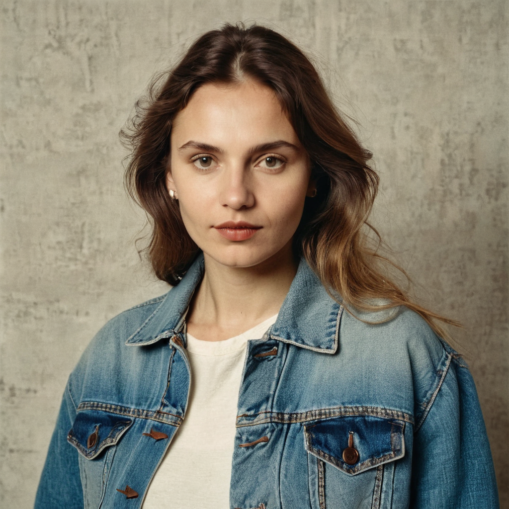
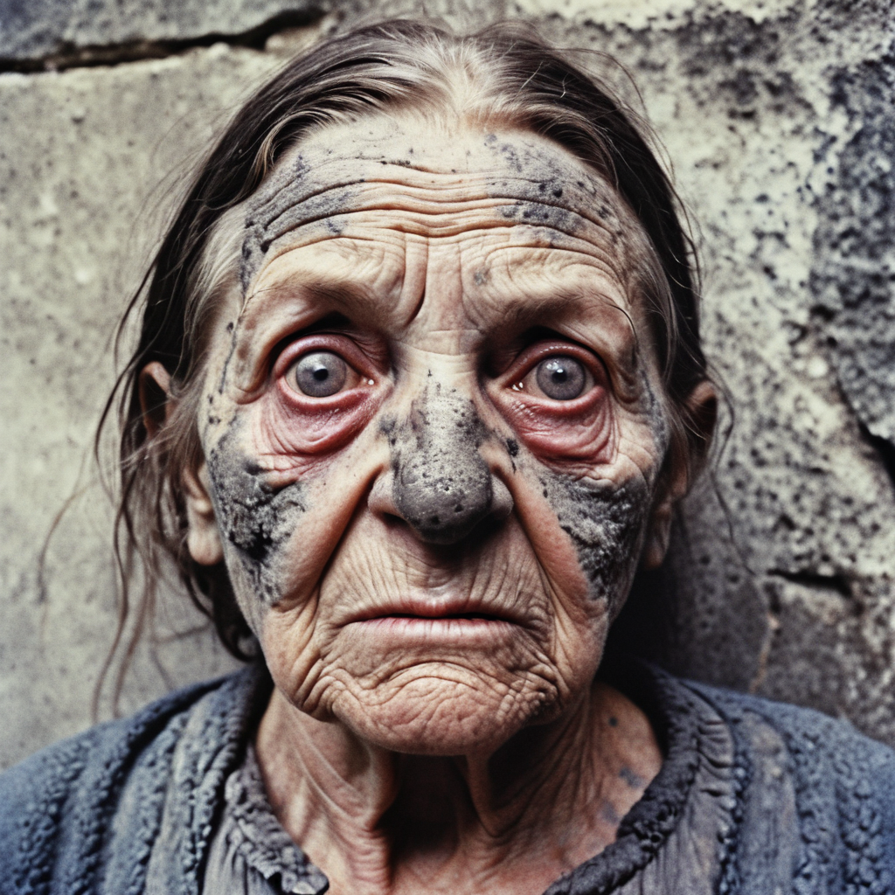
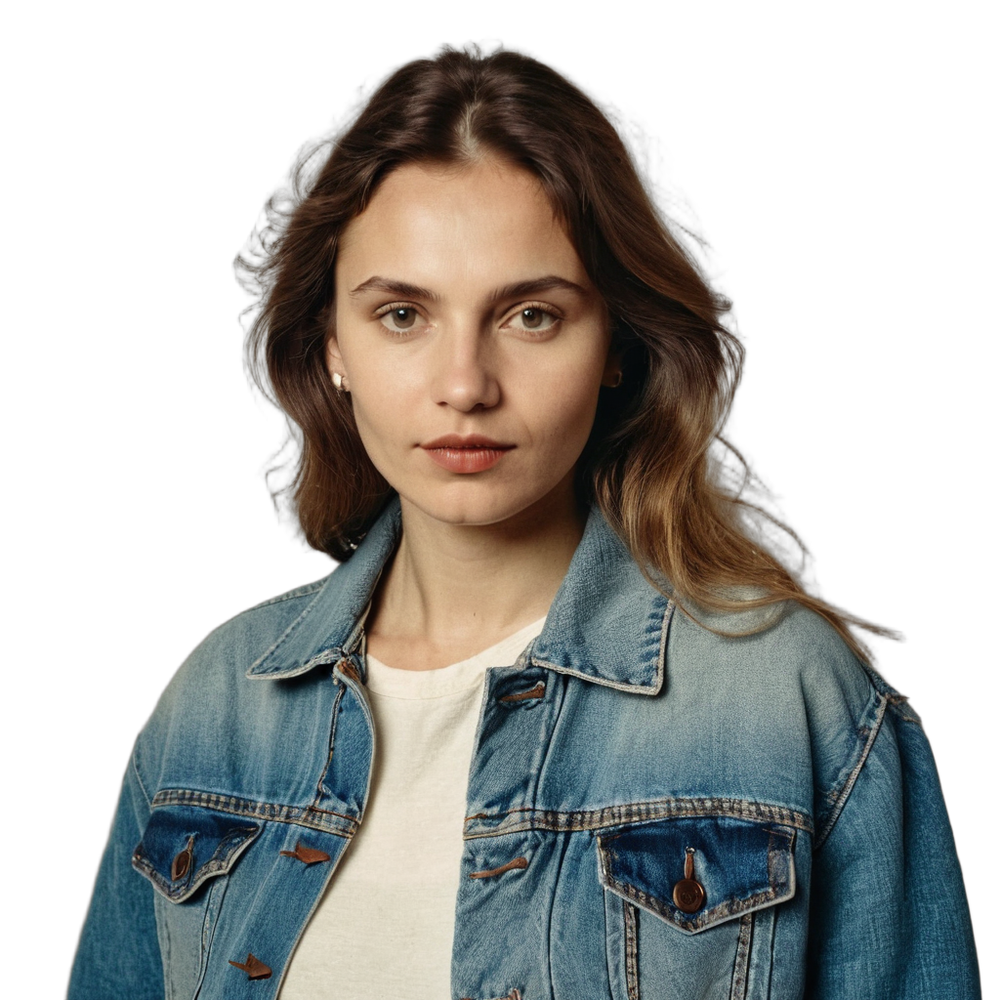

# SDXL Image Harmonization

[English](#english) | [Русский](#русский)

<a id="english"></a>

## Overview

A local image-compositing pipeline that removes a portrait background, places the cutout over a scene, then harmonizes the composition with SDXL inpainting and Tile ControlNet. This is an inference demo, not a hosted service or general-purpose editor.

## Pipeline

1. [`BirefNetCutter`](cutter.py) segments `portrait_source.png` and writes `portrait_cutout.png`.
2. [`Composer.compose()`](composer.py) places the cutout over `factory.png` and creates the collage and inpainting mask. The demo uses the `full` mask, allowing the model to regenerate the whole canvas; `edge`, `background_primary`, and `figure_primary` are also available.
3. [`FactorCNetComposerInpainter`](inpainters.py) runs SDXL inpainting with Tile ControlNet.
4. The generated image and run details are saved as `outCNet.png` and `outCNet.metadata.json`.

## Repository images

| File | Purpose |
| --- | --- |
|  | `factory.png` — background used by the demo. |
|  | `portrait_source.png` — foreground input read by `main.py`. |
|  | `alternate_portrait_source.png` — an additional portrait example; not selected automatically by the demo. |
|  | `portrait_cutout.png` — intermediate transparent cutout. |
|  | `outCNet.png` — example generated result. |

To use the alternate portrait, update the source filename in `main.py` (and the matching metadata input name) to `alternate_portrait_source.png`. The cutout and generated output filenames remain unchanged. The checked-in output is an example, not a guarantee that the original background or subject details will be preserved.

## Install and run

The project requires Python 3.13 and [uv](https://docs.astral.sh/uv/). Runtime dependencies are declared in [`pyproject.toml`](pyproject.toml) and locked in [`uv.lock`](uv.lock); there is no separate `requirements.txt`.

Run from the repository root:

```sh
uv sync --locked
uv run --locked python main.py
```

The script expects `portrait_source.png` and `factory.png` in the current directory. It writes `portrait_cutout.png`, `outCNet.png`, and `outCNet.metadata.json` there.

Run the model-free regression tests with:

```sh
uv run --locked python -m unittest discover -s tests -v
```

The tests mock model inference and do not download weights. Importing `main.py` does not execute the demo; execution is protected by the main guard.

## Models and hardware

The first run requires network access to download the BiRefNet `rembg` model and the Hugging Face models used by the inpainter: the SDXL inpainting checkpoint, `xinsir/controlnet-tile-sdxl-1.0`, and `madebyollin/sdxl-vae-fp16-fix`. Model files are cached by their respective libraries. Model revisions are not pinned, so upstream changes may affect output.

The inpainter selects MPS, CUDA, then CPU, using float16 on MPS/CUDA and float32 on CPU. CPU is supported but SDXL with ControlNet can be very slow and memory intensive; an accelerator is recommended. The cutter selects compatible installed ONNX Runtime providers and can retry with CPU if accelerator session initialization fails.

The demo uses seed `1729` for generation and records the effective seed, prompt, settings, model IDs, device/dtype, and selected dependency versions in the JSON sidecar. This improves traceability but does not guarantee identical output across hardware, model revisions, or library versions.

## Limitations

- The `full` mask permits changes across the entire canvas. Choose a localized mask mode in the composition call when preservation matters more.
- The composer rounds background dimensions down to multiples of 64 and resizes the foreground for SDXL-compatible dimensions, which can resample or discard detail.
- CPU fallback provides compatibility, not speed; the SDXL + ControlNet stack may exceed the memory available on smaller devices.
- Model IDs are not revision-pinned, and generation is not guaranteed to be deterministic across environments.

---

<a id="русский"></a>

## Назначение

Локальный конвейер композитинга удаляет фон портрета, размещает вырезанный объект на фоне сцены и гармонизирует композицию с помощью SDXL Inpainting и Tile ControlNet. Это демонстрационный конвейер инференса, а не сервис или универсальный редактор.

## Этапы

1. [`BirefNetCutter`](cutter.py) сегментирует `portrait_source.png` и сохраняет вырезку в `portrait_cutout.png`.
2. [`Composer.compose()`](composer.py) размещает вырезку на `factory.png` и создает коллаж с маской. В демо используется режим `full`, позволяющий модели перерисовать весь кадр. Также доступны режимы `edge`, `background_primary` и `figure_primary`.
3. [`FactorCNetComposerInpainter`](inpainters.py) выполняет SDXL Inpainting с Tile ControlNet.
4. Результат и параметры запуска сохраняются в `outCNet.png` и `outCNet.metadata.json`.

## Изображения в репозитории

| Файл | Назначение |
| --- | --- |
|  | `factory.png` — фон, используемый демо. |
|  | `portrait_source.png` — входное изображение, которое читает `main.py`. |
|  | `alternate_portrait_source.png` — дополнительный пример; демо не выбирает его автоматически. |
|  | `portrait_cutout.png` — промежуточная вырезка с прозрачностью. |
|  | `outCNet.png` — пример результата генерации. |

Чтобы использовать альтернативный портрет, замените имя исходного файла в `main.py` и соответствующее имя входа в метаданных на `alternate_portrait_source.png`. Имена выходных файлов при этом не меняются. Сохраненный результат приведен только как пример: исходный фон и детали объекта могут измениться.

## Установка и запуск

Нужны Python 3.13 и [uv](https://docs.astral.sh/uv/). Runtime-зависимости объявлены в [`pyproject.toml`](pyproject.toml), а зафиксированные версии находятся в [`uv.lock`](uv.lock). Отдельного `requirements.txt` нет.

Запускайте из корня репозитория:

```sh
uv sync --locked
uv run --locked python main.py
```

Скрипт ожидает `portrait_source.png` и `factory.png` в текущем каталоге. Там же он создает `portrait_cutout.png`, `outCNet.png` и `outCNet.metadata.json`.

Тесты без загрузки моделей:

```sh
uv run --locked python -m unittest discover -s tests -v
```

Тесты подменяют инференс моделей и не загружают веса. Импорт `main.py` не запускает демо: запуск защищен стандартной проверкой main guard.

## Модели и оборудование

При первом запуске нужны сеть и загрузка модели BiRefNet для `rembg`, а также моделей Hugging Face: SDXL Inpainting, `xinsir/controlnet-tile-sdxl-1.0` и `madebyollin/sdxl-vae-fp16-fix`. Библиотеки сохраняют их в свои кеши. Ревизии моделей не закреплены, поэтому обновления могут влиять на результат.

Инпейнтер выбирает MPS, CUDA, затем CPU; на MPS/CUDA используется float16, на CPU — float32. CPU поддерживается, но SDXL с ControlNet работает медленно и требует много памяти; рекомендуется ускоритель. Cutter выбирает доступные провайдеры ONNX Runtime и при ошибке инициализации ускорителя может повторить запуск на CPU.

Для генерации используется seed `1729`. В JSON рядом с изображением записываются фактический seed, prompt, настройки, ID моделей, устройство и тип данных, а также версии зависимостей. Это повышает прослеживаемость запуска, но не гарантирует идентичный результат на разных устройствах, версиях библиотек и ревизиях моделей.

## Ограничения

- Маска `full` разрешает изменения по всему кадру. Если важнее сохранить исходные детали, используйте локальный режим маски.
- Размер фона округляется вниз до кратного 64, а передний план масштабируется под размеры SDXL; это может изменить или удалить детали.
- Работа на CPU обеспечивает совместимость, но не скорость; SDXL + ControlNet может потребовать больше памяти, чем доступно на небольших устройствах.
- Ревизии моделей не закреплены, а детерминированность между разными окружениями не гарантируется.
